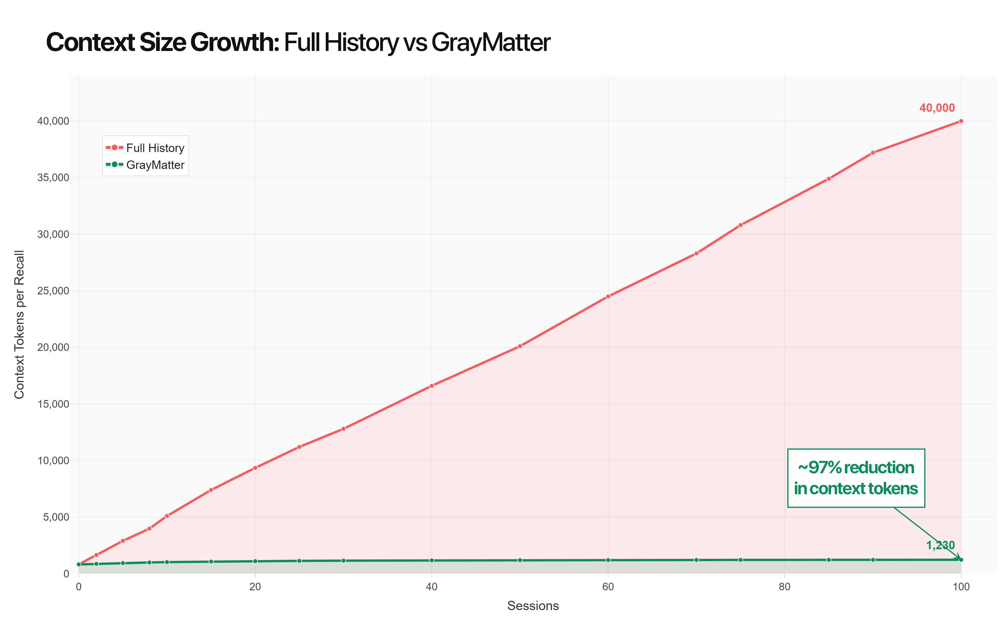
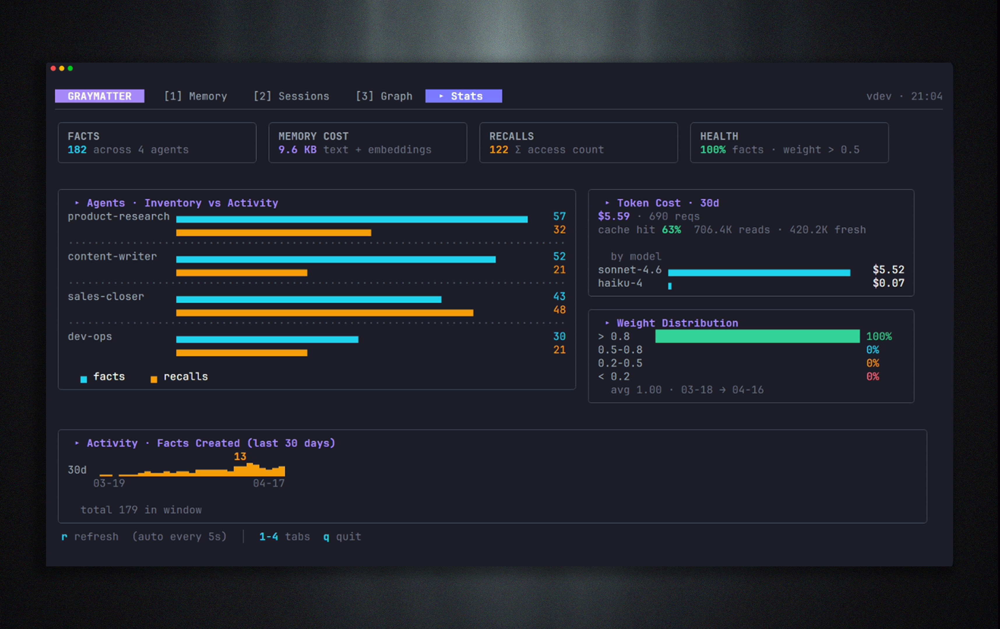

<div align="center">
  
</div>

<h1 align="center"> GrayMatter </h1>


<p align="center">
  <a href="https://github.com/angelnicolasc/graymatter/actions/workflows/ci.yml"></a>
  <a href="https://pkg.go.dev/github.com/angelnicolasc/graymatter"></a>
  <a href="https://github.com/angelnicolasc/graymatter/releases/tag/v0.5.1"></a>
  
  
  
  
<div align="center">
<br />

<strong>Three lines of code to give your AI agents persistent memory and cut token usage by 90%.</strong>
<br /><br />
One binary. Drop it in. Run it. No Docker, no databases, no config files, no cloud accounts, no bullshit.
<br /><br />
<strong>General-purpose MCP server. Zero vendor lock-in.</strong>
<br />
Works with Claude Code, Cursor, Codex, OpenCode, Antigravity — and any MCP-compatible client.
<br />
Also a plain Go library if you don't use MCP.
<br /><br />
Free. Offline. No account required.

<br />
</div>

```go
ctx := context.Background()
mem := graymatter.New(".graymatter")
mem.Remember(ctx, "agent", "user prefers bullet points, hates long intros")
facts, _ := mem.Recall(ctx, "agent", "how should I format this response?")
// ["user prefers bullet points, hates long intros"]
```

---

## Why

Every AI agent is **stateless by default**. Each run re-injects the full
conversation history — and that history grows linearly. Two prompts in and you've already burned half of your daily quota.

That's not just a memory problem. That's a money and performance problem.


**Mem0, Zep, Supermemory** solve this — but they're Python/TypeScript-only
and require a running server. The Go ecosystem has no production-ready,
embeddable, zero-dependency memory layer for agents.

That gap is GrayMatter.

<p align="center">
  
</p>


<p align="center">
<strong>~97% reduction in context tokens</strong> — versus full-history injection.<br>
Context quality <em>improves</em> over time as consolidation surfaces only what matters.<br>
No Docker. No Redis. No API key required for storage.<br><br>
Drop it in once. It auto-connects to <strong>Claude Code, Cursor, Codex, OpenCode, Antigravity</strong> — any MCP-compatible client picks it up automatically.
</p>

---

## Observability

You can't improve what you can't see.

`graymatter tui` opens a live terminal dashboard with everything your
agent memory is doing — no extra setup required.

<p align="center">
  
</p>

**What you get at a glance:**

- **Facts** — total stored, distributed across agents
- **Memory cost** — KB on disk (text + embeddings), not tokens
- **Recalls** — cumulative access count across all sessions
- **Health** — percentage of facts above relevance threshold (weight > 0.5)
- **Token cost (30d)** — real spend breakdown by model, with cache hit rate
- **Agent activity** — facts vs recalls per agent, side by side
- **Weight distribution** — how consolidated your memory is over time
- **Activity timeline** — facts created per day, last 30 days

The dashboard auto-refreshes every 5 seconds. Press `1–4` to switch tabs,
`r` to force refresh, `q` to quit.

---


## Install

**Binary (recommended):**

```bash
# Linux (x86_64)
curl -sSL -o graymatter.tar.gz https://github.com/angelnicolasc/graymatter/releases/download/v0.5.1/graymatter_0.5.1_linux_amd64.tar.gz
tar -xzf graymatter.tar.gz
sudo mv graymatter /usr/local/bin/

# Linux (ARM64)
curl -sSL -o graymatter.tar.gz https://github.com/angelnicolasc/graymatter/releases/download/v0.5.1/graymatter_0.5.1_linux_arm64.tar.gz
tar -xzf graymatter.tar.gz
sudo mv graymatter /usr/local/bin/

# macOS (Apple Silicon)
curl -sSL -o graymatter.tar.gz https://github.com/angelnicolasc/graymatter/releases/download/v0.5.1/graymatter_0.5.1_darwin_arm64.tar.gz
tar -xzf graymatter.tar.gz
sudo mv graymatter /usr/local/bin/

# Windows (PowerShell)
iwr https://github.com/angelnicolasc/graymatter/releases/download/v0.5.1/graymatter_0.5.1_windows_amd64.zip -OutFile graymatter.zip
Expand-Archive graymatter.zip -DestinationPath .\graymatter_cli
```

**Go install:**

```bash
go install github.com/angelnicolasc/graymatter/cmd/graymatter@latest
```

**Library:**

```bash
go get github.com/angelnicolasc/graymatter
```
---

## MCP clients (drop-in)

```bash
graymatter init
```

One command auto-wires GrayMatter into every supported client at once.
Existing entries from other MCP servers are **merged, not overwritten** —
safe to run in any repo.

| Client | Config file auto-wired | Scope |
|--------|------------------------|-------|
| Claude Code | `.mcp.json` | project |
| Cursor | `.cursor/mcp.json` | project |
| Codex (OpenAI) | `~/.codex/config.toml` | home |
| OpenCode | `opencode.jsonc` | project |
| Antigravity (Google) | `mcp_config.json` | project (opt-in: `--with-antigravity`) |

Narrow down what gets wired:

```bash
graymatter init --only claudecode,cursor     # whitelist
graymatter init --skip-codex --skip-opencode # blacklist
graymatter init --with-antigravity           # include opt-in clients
```

Then **restart your editor** (or toggle the MCP server off/on in its
settings). Five tools become available:

| Tool | What it does |
|------|-------------|
| `memory_search` | Recall facts for a query |
| `memory_add` | Store a new fact |
| `checkpoint_save` | Snapshot current session |
| `checkpoint_resume` | Restore last checkpoint |
| `memory_reflect` | Add / update / forget / link memories (agent self-edit) |

### Any other MCP-compatible client

GrayMatter speaks plain MCP. If your client isn't on the table above,
point it at the binary:

```bash
graymatter mcp serve              # stdio transport
graymatter mcp serve --http :8080 # HTTP transport
```

The schema is identical to every other MCP server — `command` +
`args: ["mcp", "serve"]`. No proprietary glue.

### Global install (all projects)

If you'd rather not run `graymatter init` in every repo, drop the same
JSON into the editor's global config — `~/.cursor/mcp.json` for Cursor,
`~/.claude/mcp.json` for Claude Code:

```json
{
  "mcpServers": {
    "graymatter": {
      "command": "graymatter",
      "args": ["mcp", "serve"]
    }
  }
}
```

`graymatter` must be on `PATH`. The `init` command handles this
automatically on Windows via the User `PATH` registry; on macOS / Linux
the recommended install path `/usr/local/bin` is already on `PATH`.

---

## How memories get stored

There are **four** ways a fact ends up in the store. You don't have to pick one — they compose:

| Path | Who calls it | When to use |
|------|--------------|-------------|
| `mem.Remember(ctx, agent, text)` | Your code, explicitly | You already know the exact string worth keeping. |
| `mem.RememberExtracted(ctx, agent, llmResponse)` | Your code, on raw LLM output | You want GrayMatter to pull atomic facts out of a full response for you (LLM-assisted; falls back to storing the raw text if no API key is set). |
| `memory_reflect` (MCP tool) | The LLM itself, mid-session | Claude Code / Cursor agents self-curate: add, update, forget, or link memories when they notice a contradiction, finish a task, or learn a preference. |
| `Consolidate` (async, on by default) | Background goroutine | Summarises, decays, and prunes over time. Runs automatically after writes once `ConsolidateThreshold` is hit. |

**Forgetting a single `Remember` call is not fatal.** `memory_reflect` lets the
agent fix its own memory as it works, and `Consolidate` curates the store
over time. That's why long interactive sessions in **Claude Code Desktop**
and **Cursor** are a sweet spot for GrayMatter — not only 24/7 autonomous
agents. The LLM maintains its own memory through MCP.

---

## Library usage

Three functions cover 95% of use cases. All methods accept `context.Context` as the first argument so timeouts and cancellation propagate end-to-end — no wrappers needed.

```go
import "github.com/angelnicolasc/graymatter"

ctx := context.Background()

// Open (or create) a memory store in the given directory.
mem := graymatter.New(".graymatter")
defer mem.Close()

// Always check health in production — New() never panics, but it may degrade
// to no-op mode if the data dir is unwritable or bbolt fails to open.
if !mem.Healthy() {
    log.Fatalf("graymatter: %v", mem.Status().InitError)
}

// Store an observation.
mem.Remember(ctx, "sales-closer", "Maria didn't reply Wednesday. Third touchpoint due Friday.")

// Retrieve relevant context for a query.
facts, _ := mem.Recall(ctx, "sales-closer", "follow up Maria")
// ["Maria didn't reply Wednesday. Third touchpoint due Friday."]
```

Context propagates everywhere — timeouts and traces work as expected:

```go
ctx, cancel := context.WithTimeout(context.Background(), 2*time.Second)
defer cancel()

if err := mem.Remember(ctx, "agent", "observation"); err != nil { ... }
results, err := mem.Recall(ctx, "agent", "query")
```

### Full agent pattern

```go
ctx := context.Background()
mem := graymatter.New(project.Root + "/.graymatter")
defer mem.Close()
if !mem.Healthy() {
    log.Fatalf("graymatter: %v", mem.Status().InitError)
}

// 1. Recall before calling the LLM.
memCtx, _ := mem.Recall(ctx, skill.Name, task.Description)

messages := []anthropic.MessageParam{
    {Role: "system", Content: skill.Identity + "\n\n## Memory\n" + strings.Join(memCtx, "\n")},
    {Role: "user",   Content: task.Description},
}

// 2. Call your LLM.
response, _ := client.Messages.New(ctx, anthropic.MessageNewParams{...})

// 3a. If you already have a clean string worth keeping, store it directly.
mem.Remember(ctx, skill.Name, "Maria prefers Slack over email; replies within 2h.")

// 3b. Or let GrayMatter pull atomic facts out of the raw response for you.
//     Uses ANTHROPIC_API_KEY if set; otherwise stores the raw text as a single fact.
mem.RememberExtracted(ctx, skill.Name, responseText)
```

> Inside Claude Code / Cursor you don't need either call — the LLM uses the
> `memory_reflect` MCP tool to self-curate. See
> [Claude Code / Cursor (MCP)](#claude-code--cursor-mcp) below.

### Config

```go
mem, err := graymatter.NewWithConfig(graymatter.Config{
    DataDir:          ".graymatter",
    TopK:             8,
    EmbeddingMode:    graymatter.EmbeddingAuto,  // Ollama → OpenAI → Anthropic → keyword
    OllamaURL:        "http://localhost:11434",
    OllamaModel:      "nomic-embed-text",
    AnthropicAPIKey:  os.Getenv("ANTHROPIC_API_KEY"),
    OpenAIAPIKey:     os.Getenv("OPENAI_API_KEY"),
    DecayHalfLife:    30 * 24 * time.Hour,        // 30 days
    AsyncConsolidate: true,
})
```

---

## CLI

```bash
graymatter init                                    # create .graymatter/ + .mcp.json
graymatter remember "agent" "text to remember"    # store a fact
graymatter remember --shared "text"               # store in shared namespace (all agents)
graymatter recall   "agent" "query"               # print context
graymatter recall   --all "agent" "query"         # merge agent + shared memory
graymatter checkpoint list    "agent"             # show saved checkpoints
graymatter checkpoint resume  "agent"             # print latest checkpoint as JSON
graymatter mcp serve                              # start MCP server (Claude Code / Cursor)
graymatter mcp serve --http :8080                 # HTTP transport
graymatter export --format obsidian --out ~/vault # dump to Obsidian vault
graymatter tui                                    # 4-view terminal UI
graymatter run agent.md [--background]            # run a SKILL.md agent file
graymatter sessions list                          # list managed agent sessions
graymatter plugin install manifest.json           # install a plugin
graymatter server --addr :8080                    # REST API server
```

Global flags: `--dir` (data dir), `--quiet`, `--json`

---


## Memory lifecycle

```
Recall(agent, task)          ← hybrid: vector + keyword + recency → top-8 facts
    ↓
Inject into system prompt    ← your 3 lines of code
    ↓
Agent runs
    ↓
Remember(agent, observation) ← store key facts during/after run
    ↓
Consolidate() [async]        ← summarise + decay + prune (LLM optional)
```

Consolidation is the only "smart" step. Everything else is deterministic.
Without consolidation, GrayMatter still works — it just doesn't compress over time.

Consolidation auto-enables when `ANTHROPIC_API_KEY` is set. To use Ollama:

```go
cfg := graymatter.DefaultConfig()
cfg.ConsolidateLLM = "ollama"
```

---


## Token efficiency

Numbers produced by `go run ./benchmarks/token_count` — real Recall calls,
keyword embedder, no LLM required:

| Sessions | Full injection | GrayMatter | Reduction |
|----------|---------------|------------|-----------|
| 1        | ~80 tokens    | ~80 tokens | 0% |
| 10       | ~630 tokens   | ~550 tokens | 12% |
| 30       | ~1,880 tokens | ~550 tokens | 71% |
| 100      | ~6,960 tokens | ~670 tokens | **90%** |

Each "session" = one paragraph-length agent observation (~60 words).
GrayMatter always injects only the top-8 most relevant observations for the query.
With vector embeddings the recall precision improves, maintaining similar reduction ratios.

Reproduce locally:

```bash
go run ./benchmarks/token_count
```


---

## Storage

| Layer | Tech | What it holds |
|-------|------|--------------|
| KV store | bbolt (pure Go, ACID) | Sessions, checkpoints, facts, metadata, KG |
| Vector index | chromem-go (pure Go) | Semantic embeddings, hybrid retrieval |
| Export | Markdown files | Human-readable, git-friendly, Obsidian-compatible |

Single file: `~/.graymatter/gray.db`  
Single folder: `.graymatter/vectors/`

No migrations. No schema versions. Append-only with decay-based eviction.

---

## Embeddings

GrayMatter degrades gracefully. It works without any embedding model.

| Mode | When |
|------|------|
| **Ollama** (default) | Machine has Ollama running with `nomic-embed-text` |
| **OpenAI** | `OPENAI_API_KEY` set, Ollama not available |
| **Anthropic** | `ANTHROPIC_API_KEY` set, Ollama and OpenAI not available |
| **Keyword-only** | No embedding available — TF-IDF + recency, zero deps |

Auto-detection order in `EmbeddingAuto` mode: Ollama → OpenAI → Anthropic → keyword.

```bash
# Pull the embedding model once (Ollama):
ollama pull nomic-embed-text

# Or set an API key (OpenAI or Anthropic):
export OPENAI_API_KEY=sk-...
export ANTHROPIC_API_KEY=sk-ant-...
```


---

## Testing

The full test suite requires no LLM and no network — every test uses
`t.TempDir()` with a keyword embedder or injected stubs. Runs clean on
Linux, macOS, and Windows in CI.

```bash
# Core library
go test -count=1 -timeout=120s ./pkg/memory/...

# CLI / server / plugins
cd cmd/graymatter && go test -count=1 -timeout=120s ./internal/...
```

| Package | Tests | What's covered |
|---------|-------|----------------|
| `pkg/memory` | 42 unit tests + 3 fuzz targets | Store lifecycle, hybrid recall, RRF fusion, decay math, semaphore, concurrent writes, vector paths, dimension guard |
| `internal/harness` | 21 | Agent file parsing, retry/backoff, session recovery |
| `internal/kg` | 21 | Graph CRUD, entity extraction, weight decay, Obsidian export |
| `internal/server` | 11 | All REST endpoints, concurrent remember/recall, cancelled-context requests |
| `internal/plugin` | 10 | Install, list, remove, E2E echo plugin binary |

**Fuzz targets** (`pkg/memory`): `FuzzTokenize`, `FuzzUnmarshalFact`, `FuzzKeywordScore` — each with a seeded corpus so they run deterministically in CI and can be extended with `go test -fuzz`.

**Core library coverage: 73.5%** (CI gate: ≥ 70%). Measured without mocks — real bbolt + chromem-go instances in a temp directory.

Token-reduction benchmark (also zero deps):

```bash
go run ./benchmarks/token_count
```

---

## Build from source

```bash
git clone https://github.com/angelnicolasc/graymatter
cd graymatter
CGO_ENABLED=0 go build -ldflags="-s -w -X main.version=dev" -o graymatter ./cmd/graymatter
```

Output: single static binary, ~10 MB, no runtime dependencies.

---

## Metrics & APM hooks


The REST server (`graymatter server`) exposes a `/metrics` endpoint powered by Go's standard `expvar` package — zero extra dependencies.

```
GET /metrics
```

```json
{
  "requests_total":     {"remember": 120, "recall": 340, "healthz": 5},
  "request_latency_us": {"remember": 4200, "recall": 1800},
  "facts_total":        {"stored": 120},
  "recall_total":       {"served": 340}
}
```

For library users, `memory.StoreConfig` exposes hooks for APM integration:

```go
store, err := memory.Open(memory.StoreConfig{
    DataDir:       ".graymatter",
    DecayHalfLife: 30 * 24 * time.Hour,

    // Called after every Recall with agent ID, query, result count, and latency.
    OnRecall: func(agentID, query string, n int, d time.Duration) {
        metrics.RecordHistogram("graymatter.recall.latency", d.Seconds())
    },

    // Called after every successful Put with agent ID, fact ID, and latency.
    OnPut: func(agentID, factID string, d time.Duration) {
        metrics.Increment("graymatter.facts.stored")
    },

    // Called when a vector upsert fails after the bbolt write succeeded.
    // The fact is durably queued and retried on the next reconcile tick.
    OnVectorIndexError: func(agentID, factID string, err error) {
        log.Printf("vector index lag: agent=%s fact=%s err=%v", agentID, factID, err)
    },

    // How often to drain the pending-vector queue (default 30s, 0 disables).
    VectorReconcileInterval: 30 * time.Second,

    // Routes internal log events to any standard logger.
    Logger: slog.NewLogLogger(slog.Default().Handler(), slog.LevelDebug),

    // Swap the vector backend entirely — bring your own Qdrant, pgvector, etc.
    VectorBackend: myQdrantAdapter,
})
```

---


## What GrayMatter is NOT

- Not tied to any vendor. It's an MCP server + Go library — not a Claude-Code-only or Cursor-only tool.
- Not a framework. Not an agent runner. Not a replacement for your existing tooling.
- Not a hosted service. Not a SaaS. Not a cloud product.
- Not a knowledge base UI. Not Notion. Not Obsidian.
- Not trying to win the enterprise memory market.

It is exactly one thing: **the missing stateful layer for Go CLI agents**,
packaged as a library you import in three lines.

---

## Roadmap

- [x] Library: `Remember` / `Recall` / `Consolidate`
- [x] bbolt + chromem-go storage
- [x] Ollama + OpenAI + Anthropic + keyword-only embedding
- [x] Hybrid retrieval (vector + keyword + recency, RRF fusion)
- [x] CLI: `init remember recall checkpoint export run sessions plugin server`
- [x] MCP server (Claude Code / Cursor) + `memory_reflect` self-edit tool
- [x] Knowledge graph (entity extraction, node/edge linking, Obsidian export)
- [x] Shared memory across agents (`--shared`, `--all` flags, `__shared__` namespace)
- [x] REST API server mode (`graymatter server --addr :8080`)
- [x] Plugin system (JSON line protocol, `graymatter plugin install/list/remove`)
- [x] 4-view Bubble Tea TUI (Memory / Sessions / Knowledge Graph / Stats)
- [x] Context-propagation API — all public methods accept `context.Context` (ctx-first, uniform)
- [x] `Healthy()` / `Status()` — observable no-op mode; production callers detect init failures
- [x] Durable vector reconciliation — `bucketPendingVector` closes the crash window; background reconcile loop (configurable interval); `PendingVectorCount()` for health introspection
- [x] `AdvancedStore` interface — narrow, stable public surface for CLI/MCP/TUI; internal refactors no longer break public API
- [x] `ConsolidateThreshold` default lowered to 20 — consolidation fires in demos and first-week production use
- [x] `OnVectorIndexError` / `VectorReconcileInterval` hooks for durable vector retry observability
- [x] Pluggable `VectorStore` interface (swap chromem-go for Qdrant, pgvector, etc.)
- [x] expvar `/metrics` endpoint — zero-dep, stdlib-only observability
- [x] `OnRecall` / `OnPut` / `Logger` hooks for APM integration
- [x] Embedding dimension guard — warns on provider switch instead of silent corruption
- [x] go.work workspace — core library imports zero TUI/CLI dependencies
- [x] Three-platform CI (Linux, macOS, Windows) + 73.5% coverage gate
- [x] Fuzz testing: `FuzzTokenize`, `FuzzUnmarshalFact`, `FuzzKeywordScore`
- [ ] Ollama-backed consolidation LLM (Ollama as summariser, not just embedder)
- [ ] WebSocket streaming for REST API

---

*GrayMatter — v0.5.1 — April 2026*
